# testApplicationA

# CI/CD Pipeline Documentation

## Overview
This repository uses GitHub Actions for continuous integration and deployment. The pipeline automatically manages version updates and Helm chart synchronization with strict validation to ensure reliability.

## Workflow Structure

### 🚀 Pipeline Flow Diagram

```mermaid
graph TD
    A[📤 Push to main branch] --> B[🔍 version-check]
    B --> |"✅ VERSION file changed?"| C[⚙️ setup]
    B --> |"❌ No VERSION change"| Z[🚫 Skip build]
    
    C --> |"📊 Read current version<br/>🧮 Calculate new version"| D[✅ chart-validation]
    C --> E[📝 version-update]
    
    D --> |"🔐 Validate Helm Chart<br/>🔗 repository access"| E
    
    E --> |"📄 Update VERSION file<br/>📝 Create git commit<br/>⬆️ Push to main<br/>🏷️ Create git tag"| F[📋 chart-update]
    E --> G[🐳 docker-build]
    
    F --> |"⚙️ Update Helm Chart<br/>📦 appVersion"| H[🎉 Pipeline Complete]
    G --> |"🔨 Build Docker image<br/>⚠️ (no push currently)"| H
    
    subgraph "🔒 Security & Conditions"
        I["🛡️ Only on main branch<br/>✅ AND success()"]
    end
    
    subgraph "⚡ Parallel Execution Phase"
        F
        G
    end
    
    D -.-> I
    E -.-> I
    F -.-> I
    G -.-> I
    
    style A fill:#e1f5fe,stroke:#01579b,stroke-width:3px
    style C fill:#f3e5f5,stroke:#4a148c,stroke-width:3px
    style E fill:#fff3e0,stroke:#e65100,stroke-width:3px
    style F fill:#e8f5e8,stroke:#1b5e20,stroke-width:3px
    style G fill:#e8f5e8,stroke:#1b5e20,stroke-width:3px
    style H fill:#f1f8e9,stroke:#33691e,stroke-width:3px
    style Z fill:#ffebee,stroke:#b71c1c,stroke-width:3px
```



### 📋 Detailed Pipeline Steps

```mermaid
graph TD
    A[📤 Push to main] --> B[🔍 version-check]
    
    subgraph "1️⃣ Version Check Phase"
        B1["📁 Check VERSION file exists"]
        B2["🔍 Check if VERSION changed<br/>in this commit"]
        B --> B1 --> B2
        B2 --> |"✅ Changed"| B3["🚀 Proceed"]
        B2 --> |"❌ No change"| B4["🚫 Skip build"]
    end
    
    B3 --> C[⚙️ setup]
    
    subgraph "2️⃣ Setup & Configuration"
        C1["📖 Read: export VERSION=0.0.0"]
        C2["🧮 Calculate: NEW_VERSION=0.1.0"]
        C3["📤 Output variables"]
        C --> C1 --> C2 --> C3
    end
    
    C3 --> D[✅ chart-validation]
    C3 --> E[📝 version-update]
    
    subgraph "3️⃣ Chart Validation"
        D1["🔐 Setup SSH keys"]
        D2["📥 Clone Helm Chart repo"]  
        D3["✅ Validate Chart.yaml"]
        D --> D1 --> D2 --> D3
    end
    
    subgraph "4️⃣ Version Update"
        E1["📝 Update VERSION file:<br/>export VERSION=0.1.0"]
        E2["📝 Git commit & push"]
        E3["🏷️ Create tag: v0.1.0"]
        E --> E1 --> E2 --> E3
    end
    
    D3 --> E
    E3 --> F[📋 chart-update]
    E3 --> G[🐳 docker-build]
    
    subgraph "5️⃣ Chart Update (Parallel)"
        F1["📥 Clone Helm Chart repo"]
        F2["⚙️ Update Chart.yaml:<br/>📦 appVersion: 0.1.0"]
        F3["📤 Git commit & push"]
        F --> F1 --> F2 --> F3
    end
    
    subgraph "6️⃣ Docker Build (Parallel)"
        G1["🛠️ Install Task tool"]
        G2["🐳 Setup Docker Buildx"]
        G3["🔨 task docker:build<br/>🏷️ Image: ...application:0.1.0"]
        G4["✅ Build Complete<br/>⚠️ (Push currently disabled)"]
        G --> G1 --> G2 --> G3 --> G4
    end
    
    F3 --> H[🎉 Pipeline Complete]
    G4 --> H
    
    style A fill:#e3f2fd,stroke:#01579b,stroke-width:3px
    style C fill:#f3e5f5,stroke:#4a148c,stroke-width:3px
    style E fill:#fff3e0,stroke:#e65100,stroke-width:3px
    style F fill:#e8f5e8,stroke:#1b5e20,stroke-width:3px
    style G fill:#e8f5e8,stroke:#1b5e20,stroke-width:3px
    style H fill:#f1f8e9,stroke:#33691e,stroke-width:3px
    style B4 fill:#ffebee,stroke:#b71c1c,stroke-width:3px
```



### 📊 Visual Flow Summary

```
🔄 GitHub Actions CI/CD Pipeline Flow
════════════════════════════════════════════════════════════════

📤 Push to main
     │
     ▼
🔍 version-check ────────❌ No VERSION change ──► 🚫 Skip build
     │
     ▼ ✅ VERSION changed
⚙️ setup (Read version: 0.0.0 → Calculate: 0.1.0)
     │
     ├─────────────────────┐
     ▼                     ▼
✅ chart-validation    📝 version-update
     │                     │
     └──────► ✅ ──────────┤
                           │
                           ├─────────┬─────────┐
                           ▼         ▼         ▼
                      🏷️ Create   📋 chart   🐳 docker
                         tag      update     build
                           │         │         │
                           └─────────┴────┬────┘
                                          ▼
                                   🎉 Pipeline Complete

Legend:
══════
🔍 Validation    📝 Update    📋 Deploy    🐳 Build    ✅ Success    ❌ Skip
```

### 📈 Pipeline Execution Matrix

| Phase | Job | Duration | Dependencies | Parallel | Status | Output |
|-------|-----|----------|--------------|----------|--------|--------|
| 🔍 **Check** | `version-check` | ~1min | - | ❌ | Required | Validates VERSION change |
| ⚙️ **Setup** | `setup` | ~2min | version-check | ❌ | Required | `current_version`, `new_version` |
| ✅ **Validate** | `chart-validation` | ~3min | setup | ❌ | Required | Chart repo access verified |
| 📝 **Update** | `version-update` | ~2min | setup + chart-validation | ❌ | Critical | VERSION file updated, tag created |
| 📋 **Deploy** | `chart-update` | ~3min | version-update | ✅ | Optional | Helm chart synchronized |
| 🐳 **Build** | `docker-build` | ~5min | version-update | ✅ | Optional | Docker image built |

**Legend:**
- ✅ = Can run in parallel
- ❌ = Must run sequentially  
- **Critical** = Pipeline fails if this fails
- **Optional** = Pipeline continues if this fails

### Trigger Conditions
The workflow is triggered on:
- Push to `main` branch
- Pull requests to `main` branch (only on opened and reopened)
- Manual trigger (workflow_dispatch)

### Jobs Execution Order

#### 1. Version Check
- Checks if the VERSION file has been modified
- Skips the build if no version changes are detected
- Handles first commit scenarios appropriately
- Only runs on push events or PR open/reopen events

#### 2. Setup
- Sets up Python environment
- Configures dependency caching
- **Reads and calculates version numbers**
- Provides version outputs for subsequent jobs

#### 3. Chart Validation
- **Validates chart repository access without making changes**
- Tests SSH connection and repository permissions
- Verifies Chart.yaml file exists and is parseable
- Logs current and planned version information
- **Critical**: Stops pipeline if validation fails

#### 4. Version Update
- **Only executes if all previous steps succeed**
- Updates VERSION file with new version number
- Creates and pushes version tag
- Commits changes directly to main branch
- **Protected**: Will not run if any validation fails

#### 5. Chart Update (Parallel)
- **Only executes after successful version update**
- Updates the Helm chart repository
- Synchronizes new version with chart appVersion
- Uses SSH for secure repository access
- Commits and pushes chart changes

#### 6. Docker Build (Parallel)
- **Only executes after successful version update**
- Installs Task tool for build automation
- Sets up Docker Buildx for container building
- Builds Docker image using Taskfile configuration
- **Note**: Image push is currently disabled
- Uses environment variable for version tagging

## Prerequisites

### Required Secrets
Add the following secrets to your GitHub repository (Settings > Secrets and variables > Actions):

1. `SSH_PRIVATE_KEY`
   - SSH private key for accessing the Helm chart repository
   - Must be in OpenSSH format (PEM)
   - Must have read/write access to the Helm chart repository
   - The key will be automatically formatted to handle line ending issues

### Automatic Secrets

1. `GITHUB_TOKEN`
   - Automatically provided by GitHub Actions
   - No manual setup required
   - Used for repository operations within the workflow
   - Has permissions based on the workflow's permission settings
   - Automatically rotated for each workflow run

### Required Files

1. `VERSION` file
   - Must exist in the repository root
   - Format: `export VERSION=x.y.z`
   - Example: `export VERSION=0.0.0`

2. `ci.yml` file
   - Must exist in the repository root
   - Contains the Helm chart repository SSH URL
   - Format: `helm-chart-ssh-url: "git@github.com:owner/repo.git"`
   - The repository name will be automatically extracted from the URL

## Safety Features

### Fail-Safe Mechanisms
1. **Pre-validation**: Chart repository access is validated before any changes
2. **Sequential execution**: Version update only happens after all validations pass
3. **Atomic operations**: Each step includes comprehensive error handling
4. **Branch protection**: All operations are restricted to main branch only

### Error Handling
The workflow includes comprehensive error handling for:
- File existence checks
- Version format validation
- SSH connection and authentication
- Git operation failures
- Chart repository access issues
- YAML parsing errors

## Permissions

The workflow requires the following permissions:
- `contents: write` - For pushing code and tags
- `packages: write` - For package operations
- `pull-requests: write` - For PR operations

## Concurrency Control

The workflow implements concurrency control to:
- Prevent parallel runs of the same workflow
- Cancel in-progress runs when new commits are pushed
- Group runs by workflow and PR number (for PRs) or branch (for pushes)

## Timeout Settings

Each job has a 30-minute timeout to prevent hanging workflows.

## Manual Trigger

To manually trigger the workflow:
1. Go to the "Actions" tab in your GitHub repository
2. Select the "Build and Version Management" workflow
3. Click "Run workflow"
4. Select the branch to run on
5. Click "Run workflow"

## Troubleshooting

### Common Issues

1. **SSH Connection Failures**
   - Verify SSH_PRIVATE_KEY secret is correctly set
   - Ensure the SSH key is in OpenSSH format
   - Check if the key has access to the chart repository
   - Verify the chart repository URL in ci.yml is correct

2. **Version Update Fails**
   - Check if VERSION file exists and has correct format
   - Verify repository permissions allow pushing to main branch
   - Ensure version number format is valid (x.y.z)

3. **Chart Validation Fails**
   - Verify helm-chart-ssh-url in ci.yml is accessible
   - Check if Chart.yaml exists in the target repository
   - Ensure the chart repository is on the main branch

4. **Permission Issues**
   - Verify all required permissions are set in workflow
   - Check if repository settings allow workflow access
   - Ensure SSH key has correct repository permissions

### SSH Key Setup

1. Generate an SSH key pair:
   ```bash
   ssh-keygen -t rsa -b 4096 -C "github-actions@yourdomain.com"
   ```

2. Add the public key to your chart repository's deploy keys

3. Add the private key to your repository secrets as `SSH_PRIVATE_KEY`

### Logs and Debugging

- Check the Actions tab in GitHub for detailed logs
- Each job provides step-by-step execution logs
- Error messages include specific failure reasons
- SSH connection testing is included in the logs

## Best Practices

1. **Version Management**
   - Always update VERSION file for new releases
   - Follow semantic versioning (x.y.z)
   - Commit version changes in separate commits
   - Review version increments before merging

2. **Security**
   - Regularly rotate SSH keys
   - Use repository secrets for sensitive data
   - Review workflow permissions regularly
   - Keep SSH key permissions secure (600)
   - Monitor repository access logs

3. **Maintenance**
   - Keep actions up to date
   - Monitor workflow execution times
   - Review timeout settings periodically
   - Test SSH connections regularly

4. **PR Management**
   - Use PR templates for consistency
   - Review all PR checks before merging
   - Keep PR branches up to date with main
   - Test changes in feature branches first

## Workflow Execution Flow

1. **Validation Phase**:
   - Version check → Setup → Chart validation

2. **Update Phase** (only if validation succeeds):
   - Version update → Chart update

3. **Safety Guarantees**:
   - No version changes if any step fails
   - No tags created if validation fails
   - Chart updates only after version is committed

This ensures that your main branch always remains in a consistent state.